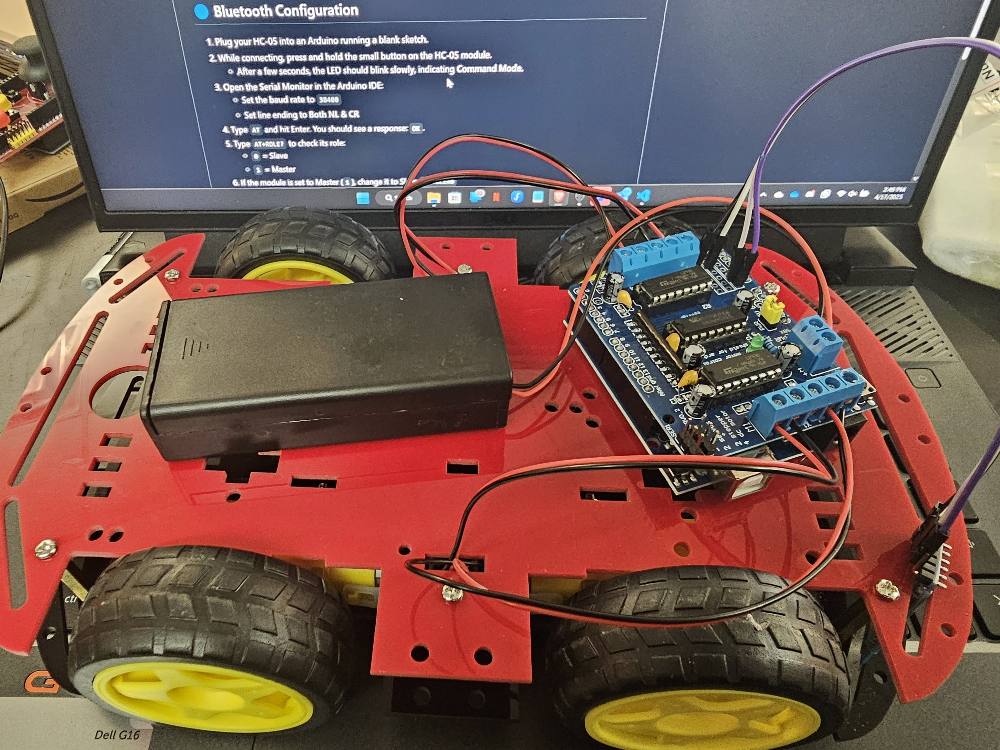
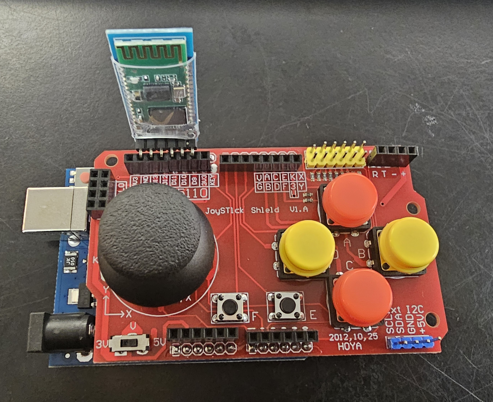

# Arduino RC Car Project

## Overview  
This branch is for the **EPICS Sumo-Bot Competition**.

### Setup Instructions  
1. Pair the Bluetooth modules.  
2. Upload `SumoBot_BT_CAR_Code` to the Arduino on your car.  
3. Upload `SumoBot_BT_Remote_Code` to the Arduino in your remote control.  
4. Connect the **Slave** HC-05 module to the **Car Arduino**.  
5. Connect the **Master** HC-05 module to the **Remote Arduino**.  

---

## 🔵 Bluetooth Instructions  

### 📶 Bluetooth Pairing Instructions (If Not Paired)

1. Grab both HC-05 Bluetooth modules.  
2. Label them as either **M** (Master) or **S** (Slave).  
   - Alternative labels: **T** = Transmitter, **R** = Receiver  
3. Connect the module to an Arduino running an empty sketch.  
   - While connecting, **hold down the small button** on the bottom right of the HC-05.  
   - After a few seconds, the module's LED should blink **slowly** — this indicates **Command Mode**.  
   - *Command Mode* allows you to check/set configuration. You only need it for setup — not future use.  
4. Open the Serial Monitor in the Arduino IDE.  
   - Set **baud rate** to `38400`  
   - Set line ending to **Both NL & CR**  
5. Type `AT` and press Enter. You should receive `OK`, confirming it's working properly.  
6. Type `AT+ROLE?` to check the module's role:  
   - `0` = Slave  
   - `1` = Master  
7. If both modules have the same role, change one typing ```AT+ROLE=#```: Replace `#` with `1` (Master) or `0` (Slave).
8. Once roles are set, connect the **Slave** module again and type: ```AT+ADDR?```, Copy the returned address
9. Connect the **Master** module and bind it to the Slave using:```AT+BIND={Slave_Address}```, Replace {Slave_Address} with the address you copied.
- Replace `{Slave_Address}` with the address you copied.  
- **IMPORTANT:** Replace all colons (`:`) with commas (`,`).  
  - Example: `AB:CD:EF1234` → `AB,CD,EF1234`
10. If the above steps are completed correctly, your modules are now **paired**!  
 - From now on, they will automatically try to connect when powered on.  

---

### 🔄 Bluetooth Connection Instructions (If Already Paired)

1. Connect a module to an Arduino running an empty sketch.  
- While connecting, hold down the small button until the LED blinks slowly — this is **Command Mode**.  
2. Open the Serial Monitor.  
- Set **baud rate** to `38400`  
- Set line ending to **Both NL & CR**  
3. Type `AT` and confirm you receive `OK`.  
4. Type `AT+ROLE?` to verify the module's role.  
5. Label each module appropriately:  
- `M` = Master  
- `S` = Slave  
- (or use `T` = Transmitter, `R` = Receiver)  

---

## 🖼️ Reference Images  

### Car Image: 


### Controller Interface:   

